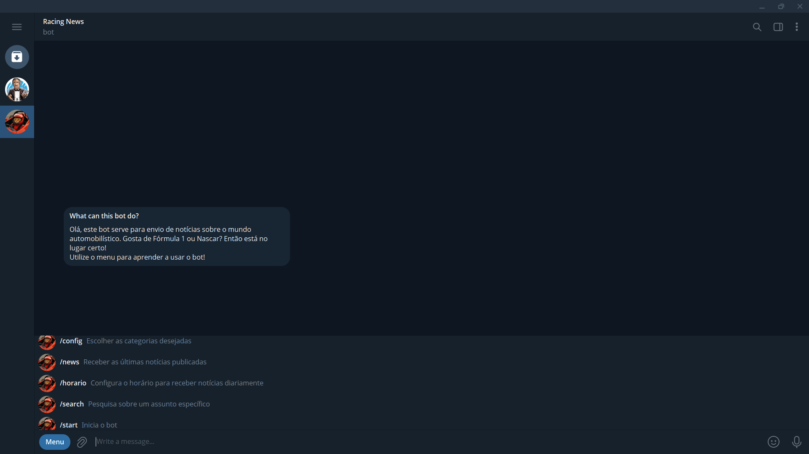
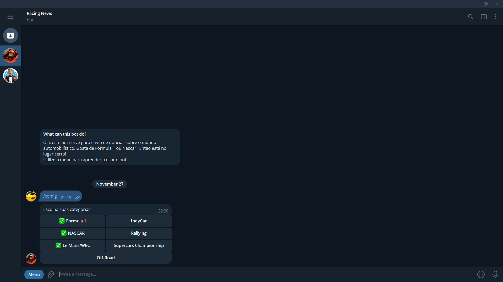
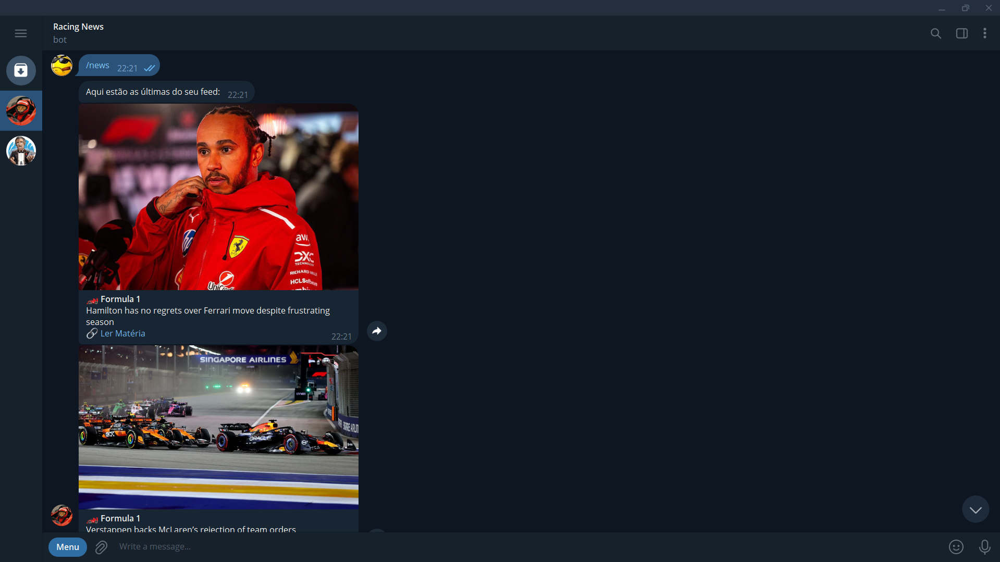
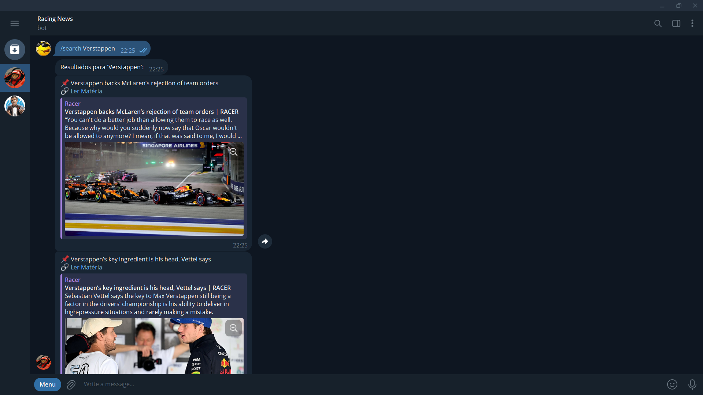
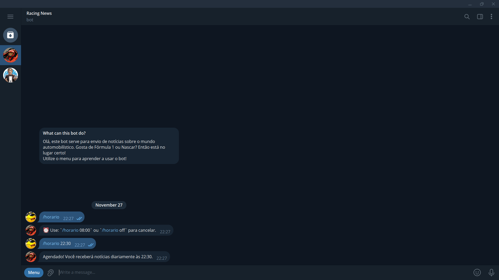
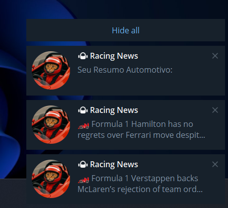

<a id="readme-top"></a>

<!-- LINKEDIN HEADER SHIELD -->

[![LinkedIn][linkedin-shield]][linkedin-url]

<!-- PROJECT INTRO -->
<br />
<div align="center">
  
  <h3 align="center">Bot de Telegram - Canal de notícias</h3>
  
  <p align="center">
    Um pipeline simples para obter notícias do mundo automobilístico e enviar para usuários no Telegram.
    <br />
  </p>

</div>

<!-- TABELA DE CONTEÚDOS -->
<details>
  <summary>Tabela de conteúdos</summary>
  <ol>
    <li>
      <a href="#sobre-o-projeto">Sobre o projeto</a>
      <ul>
        <li><a href="#desenvolvido-com">Desenvolvido com</a></li>
      </ul>
    </li>
    <li>
      <a href="#como-usar">Como usar</a>
      <ul>
        <li><a href="#pré-requisitos">Pré-requisitos</a></li>
        <li><a href="#instalação">Instalação</a></li>
      </ul>
    </li>
    <li><a href="#exemplo-de-uso">Exemplo de uso</a></li>
    <li><a href="#licença">Licença</a></li>
    <li><a href="#contato">Contato</a></li>
  </ol>
</details>

<!-- SOBRE O PROJETO -->

## Sobre o Projeto

Um sistema de monitoramento e distribuição de notícias de automobilismo que atua como uma interface entre o usuário e um banco de dados SQLite. O script realiza a ingestão de dados via feed RSS do site **Racer.com**, armazena as informações para criar um histórico persistente e as distribui por intermédio de um **Bot no Telegram**.

O diferencial do projeto é a flexibilidade de consumo: o usuário pode consultar notícias sob demanda (com filtros de busca e categorias) ou configurar uma rotina de entrega automática (agendamento de horário), garantindo que nunca perca as atualizações das suas categorias favoritas (como F1 ou Nascar).

<p align="right">(<a href="#readme-top">back to top</a>)</p>

### Desenvolvido com

Este projeto foi desenvolvido com as seguintes tecnologias:

[![Python][python-shield]][python-url]

<p align="right">(<a href="#readme-top">back to top</a>)</p>

<!-- COMO USAR -->

## Como usar

Siga os passos abaixo para configurar e executar o projeto localmente.

### Pré-requisitos

Antes de começar, você precisará de:

- **Python 3.8+** (verifique com `python --version`)
- **Token do bot de Telegram** (Obtido criando um novo bot por meio do [@BotFather](https://t.me/BotFather) no Telegram).

### Instalação

**1. Clone este repositório:**

```bash
git clone https://github.com/Cabana021/bot-telegram-racing-news
cd bot-telegram-racing-news
```

**2. Instale as dependências Python:**

```bash
pip install -r requirements.txt
```

**3. Configure o ambiente**

Antes de rodar, é necessário configurar o Token do seu bot. (Obs: Se você usa um arquivo .env, crie-o agora. Se o token for inserido direto no código, pule esta etapa, mas cuidado ao subir para o GitHub!!!).

**4. Configuração do Banco de Dados**

Primeiro, execute o script responsável por criar a estrutura do banco de dados (`racer_news.db`). Isso garantirá que as tabelas existam antes de qualquer dado ser inserido.

```
python database.py
```

**5. Ingestão inicial de dados**

Em seguida, execute o ingestor para coletar as notícias atuais do feed RSS e populá-las no banco de dados recém-criado.

```
python ingestor.py
```

**6. Execução do Bot**

Com o banco de dados pronto, inicie o bot. Ele ativará o "polling" do Telegram para escutar os comandos e interagir com os dados.

```
python bot.py
```

Após iniciar o bot, você pode interagir com ele no Telegram usando:

/start - Inicia a interação e boas-vindas.

/config - Gerencia inscrições em tópicos (Ex: Formula 1, Nascar, IndyCar).

/news - Busca as notícias mais recentes armazenadas no banco.

/search [assunto] - Pesquisa notícias específicas por palavra-chave.

/horario [hora:minuto] - Configura o agendamento automático para receber o resumo diário (Ex: /horario 20:00).

<p align="right">(<a href="#readme-top">back to top</a>)</p>

<!-- EXEMPLO DE USO -->

## Exemplo de uso

📈 Tela Inicial



<p>Interface principal do bot no Telegram, exibindo o menu de comandos rápidos para configuração de categorias, busca de notícias e agendamento de horários.</p>

<p align="right">(<a href="#readme-top">back to top</a>)</p>

📈 Comando /start


<p>Tela de boas-vindas acionada pelo comando /start. O bot apresenta suas funcionalidades principais, lista as categorias monitoradas (F1, Indy, NASCAR, WEC) e guia o usuário com um tutorial rápido ('Manual de uso') para garantir uma interação fluida desde o primeiro acesso.</p>

<p align="right">(<a href="#readme-top">back to top</a>)</p>

📈 Comando /config



<p>Gerenciamento de Assinaturas: Interface interativa acionada pelo comando /config. Utiliza Inline Keyboards para permitir que o usuário ative ou desative categorias específicas (como F1, NASCAR, WEC) com um simples toque. O bot atualiza o banco de dados e fornece feedback visual imediato (✅) sobre os tópicos seguidos.</p>

<p align="right">(<a href="#readme-top">back to top</a>)</p>

📈 Comando /news



<p>Visualização do Feed: O comando /news transforma o chat em um feed de notícias visualmente agradável. Cada notícia é apresentada como um cartão informativo, permitindo que o usuário escaneie rapidamente as manchetes do dia (como visto no exemplo com notícias de F1) antes de decidir ler o conteúdo completo.</p>

<p align="right">(<a href="#readme-top">back to top</a>)</p>

📈 Comando /search



<p>Pesquisa sob Demanda: Quer saber as últimas sobre um piloto ou equipe específica? A função /search permite filtrar o conteúdo rapidamente. Ao digitar /search Verstappen, o bot ignora o feed geral e entrega apenas o que é relevante para aquele tópico específico.</p>

<p align="right">(<a href="#readme-top">back to top</a>)</p>

📈 Comando /horario



<p>Agendamento Personalizado: O usuário define sua própria rotina de leitura. Com o comando /horario, é possível estipular um momento específico do dia (ex: 22:30) para que o bot envie automaticamente o resumo das notícias, sem necessidade de interação manual.</p>



<p>Entrega Pontual: O resultado prático da automação. Exatamente no horário escolhido, o bot 'acorda' e entrega o 'Resumo Automotivo' diretamente na barra de notificações, garantindo que o usuário se mantenha informado mesmo sem abrir o aplicativo.</p>

<p align="right">(<a href="#readme-top">back to top</a>)</p>

### Ideias de melhorias

Algumas sugestões do que você pode contribuir:

- 📊 Criar relatórios em PDF ou CSV
- ⚙️ Implementar interface gráfica (GUI)
- 🌐 Suporte para outros idiomas
- 🛡️ Melhorias na segurança e tratamento de erros

### Encontrou um bug?

Abra uma [issue](https://github.com/Cabana021/football-manager-data-analysis/issues) descrevendo o problema, e vamos resolver juntos!

**Obrigado por ajudar a tornar este projeto ainda melhor!**

<p align="right">(<a href="#readme-top">back to top</a>)</p>

<!-- LICENÇA -->

## Licença

Este projeto está sob a licença **Unlicense** - isso significa que ele é de **domínio público** e você pode fazer o que quiser com ele!

Sinta-se livre para:

- ✅ Usar comercialmente
- ✅ Modificar e adaptar
- ✅ Distribuir
- ✅ Usar em projetos privados

**Sem nenhuma restrição ou necessidade de atribuição.**

<p align="right">(<a href="#readme-top">back to top</a>)</p>

<!-- CONTATO -->

## Contato

Criado por: **Victor Cabana**. Sinta-se à vontade para me contatar:

[![LinkedIn][linkedin-shield]][linkedin-url]

[![Email][email-shield]][email-url]

<p align="right">(<a href="#readme-top">back to top</a>)</p>

<!-- MARKDOWN LINKS & IMAGES -->

[linkedin-shield]: https://img.shields.io/badge/-LinkedIn-black.svg?style=for-the-badge&logo=linkedin&colorB=0077B5
[linkedin-url]: https://www.linkedin.com/in/victor-cabana-simoes/
[email-shield]: https://img.shields.io/badge/Email-D14836?style=for-the-badge&logo=gmail&logoColor=white
[email-url]: mailto:vcabanadev@gmail.com
[python-shield]: https://img.shields.io/badge/Python-3776AB?style=for-the-badge&logo=python&logoColor=white
[python-url]: https://www.python.org/
